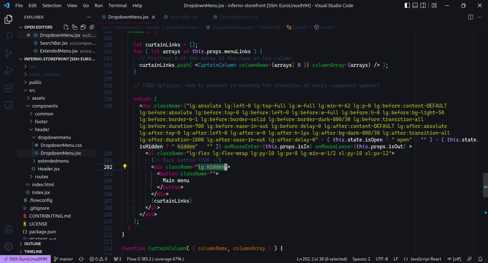

# Elizabeth Báthory

> A collection of color themes dedicated to Elizabeth Báthory, who may or may not have been a vampire.




## Instructions

- Settings in the screenshot include:
```json
{
  "editor.renderLineHighlight": "all",
  "editor.renderWhitespace": "all",
  "editor.cursorStyle": "block",
  "editor.fontFamily": "'Cascadia Code PL', 'monospace', monospace",
  "editor.fontLigatures": "'calt', 'ss01'",
  "editor.rulers": [
    100,
    120
  ]
}
```

## Contributing

If you'd like to contribute to this theme, please read the [guidelines](./.github/CONTRIBUTING.md).

## License

[NCSA](./LICENSE.md)

## Notes

Syntax highligting is tested on the file extensions I use most frequently: 
- `.v`
- `.js` (Flow)
- `.json`
- `.html`
- `.less`
- `.md`

The [icon](./img/icon.jpeg) is AI generated